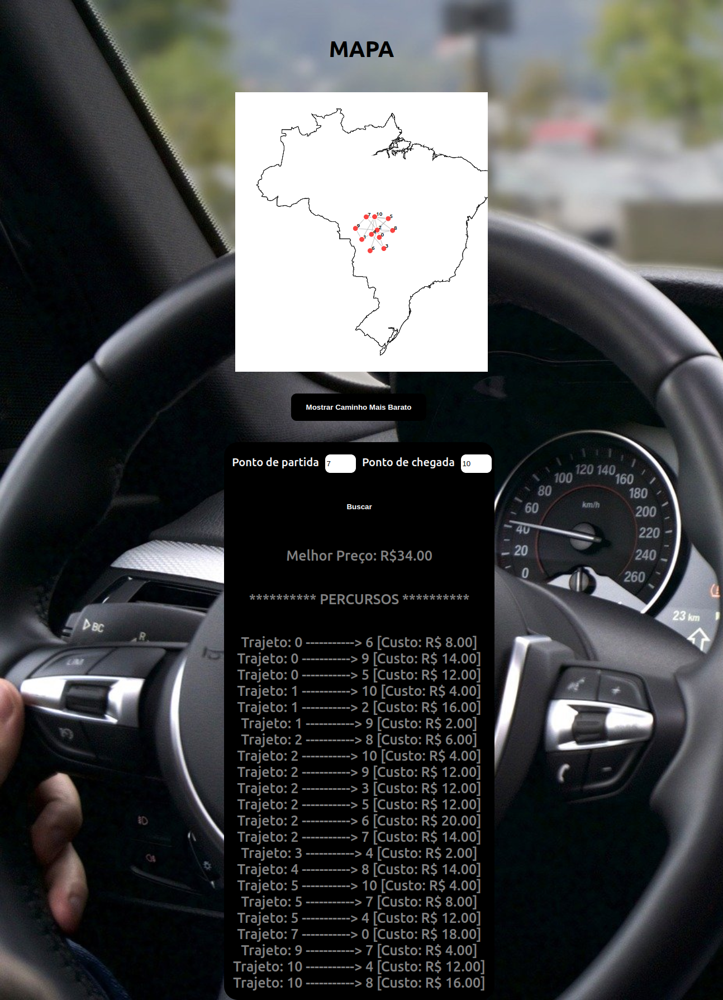

# Nome do Projeto

**Número da Lista**: 3<br>
**Conteúdo da Disciplina**: Grafos 2<br>

## Alunos

| Matrícula  | Aluno                   |
| ---------- | ----------------------- |
| 19/0046091 | Gustave Augusto Persijn |
| 19/0032863 | Lorrayne Alves Cardozo  |

## Sobre

O projeto possui o objetivo de apresentar de forma visual a implementação do algoritmo Dijkstra. Como objeto de inspiração para o trabalho de Grafos 2, utilizamos a mesma temática do trabalho proposto no [trabalho de Grafos 1](https://github.com/projeto-de-algoritmos/Grafos1_Fipe), relacionado a carros. Agora, o usuário parte do princípio de procurar o melhor trecho (de menor custo) para fazer uma viagem, pagando o menor valor nos pedágios em que passar.

## Screenshots
### 1. Página inicial


### 2. Caminho mais barato



## Instalação

### Frameworks 
ReactJS e NodeJS

### Pré-requisitos

* NodeJS
* ReactJS
* Yarn

### Instalar dependências
```
yarn install
```

### Rodar o projeto
```
yarn start
```
O projeto estará rodando na porta ```localhost:3000```

## Apresentação

[Link da apresentação](https://youtu.be/h_rSjBCdKHc)